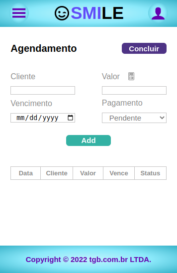

# Smile-Project

## Objetivo:

O projeto visa a construção de um aplicativo, o qual tem como função simular uma agenda integrada a uma calculadora.
Pode ser utilizado por qualquer pessoa que deseje fazer anotações de serviços prestados.
Nesse caso específico, o projeto foi feito para a área de saúde, mas é possível expândi-lo para outras áreas.

## Tecnologias:

<strong>Front</strong>:
React/Redux/Typescript/Styled-components/Storybook/Axios/Oauth(Google)

<strong>Back</strong>:
Node/MVC/ORM(Sequelize)/Jwt/Bcript

  
  
  
  
  
